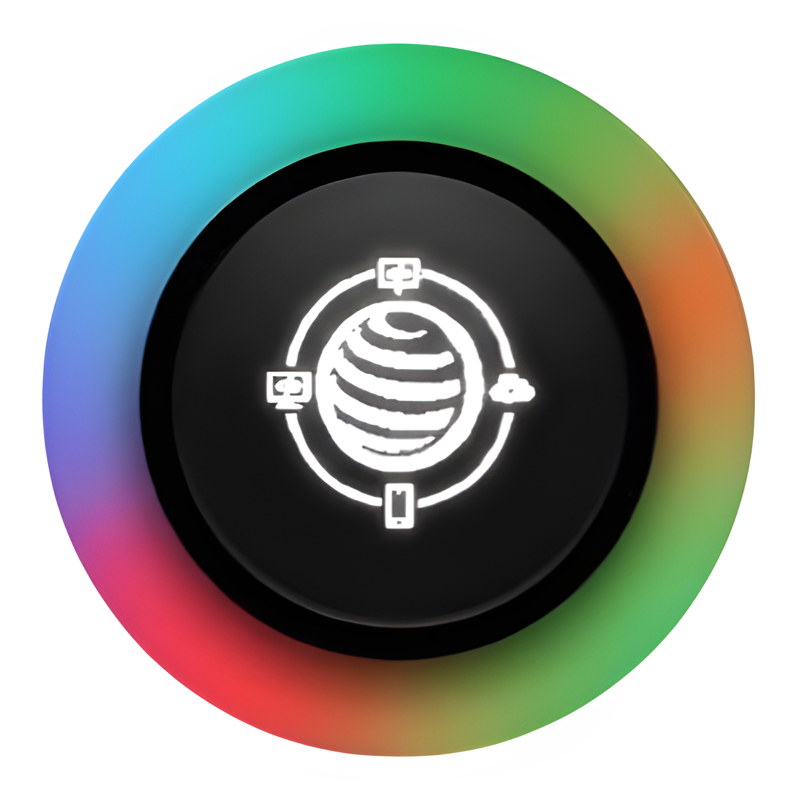

<p align="center">
  
</p>

<h1 align="center">Localist</h1>

<p align="center">
  Share a local proxy between Android and Windows with QR handoff, compact desktop UI, and release builds for GitHub.
</p>

<p align="center">
  <a href="https://flutter.dev"></a>
  <a href="https://developer.android.com"></a>
  <a href="https://learn.microsoft.com/windows/apps/"></a>
  <a href="https://github.com/MBNpro-ir/localist/actions"></a>
  <a href="https://github.com/MBNpro-ir/localist/releases"></a>
</p>

## Overview

Localist is a Flutter app for moving proxy/VPN access between Android and Windows:

- Android can share HTTP/SOCKS5 proxy endpoints and receive a remote endpoint as VPN or local proxy.
- Windows can share proxy endpoints, show QR codes, scan proxy QR codes with a webcam, run with administrator privileges, minimize to the taskbar tray, and apply Windows VPN mode through the system proxy.
- Settings are persisted in each platform's standard app-support storage so reinstalling the app keeps user preferences.
- Windows uses the Android app icon, fixed `350x720` client size, no maximize button, no resize frame, and Windows accent colors.

## Repository Layout

```text
lib/                       Flutter UI, settings, QR, proxy state, Windows Dart services
android/                   Android Kotlin VPN/proxy bridge and Gradle project
windows/                   Windows runner, Win32 MethodChannel bridge, app icon/resource setup
test/                      Flutter unit tests
.github/workflows/         GitHub Actions release pipeline
ico/                       Localist app icon assets
```

## Requirements

Install these tools before building from a fresh clone:

- Flutter stable SDK with desktop support enabled.
- Android Studio or Android command-line tools with Android SDK Platform 35+.
- JDK 17.
- Visual Studio 2022 with "Desktop development with C++" for Windows builds.
- Windows 10/11 WebView2 Runtime for the Windows QR scanner.
- 7-Zip if you want the smallest local Windows ZIP package.

Verify the toolchain:

```powershell
flutter doctor -v
flutter config --enable-windows-desktop
flutter pub get
```

Accept Android licenses when needed:

```powershell
flutter doctor --android-licenses
```

## Development Checks

Run these before opening a pull request:

```powershell
flutter pub get
flutter analyze
flutter test
```

## Android Build Commands

Debug APK:

```powershell
flutter build apk --debug
```

Smallest release APKs split by Android CPU architecture:

```powershell
flutter build apk --release `
  --split-per-abi `
  --target-platform android-arm,android-arm64,android-x64 `
  --obfuscate `
  --split-debug-info=build\symbols\android `
  --tree-shake-icons `
  --build-name=1.0.3 `
  --build-number=4
```

Release Android App Bundle:

```powershell
flutter build appbundle --release `
  --obfuscate `
  --split-debug-info=build\symbols\android-aab `
  --tree-shake-icons `
  --build-name=1.0.3 `
  --build-number=4
```

Android release outputs:

```text
build/app/outputs/flutter-apk/app-armeabi-v7a-release.apk
build/app/outputs/flutter-apk/app-arm64-v8a-release.apk
build/app/outputs/flutter-apk/app-x86_64-release.apk
build/app/outputs/bundle/release/app-release.aab
```

The current Gradle release config enables code minification, resource shrinking, icon tree-shaking, and compressed native libraries. Replace the debug signing config with your production keystore before publishing to a store.

## Windows Build Commands

Release build with Dart symbol splitting and icon tree-shaking:

```powershell
flutter build windows --release `
  --obfuscate `
  --split-debug-info=build\symbols\windows-x64 `
  --tree-shake-icons `
  --build-name=1.0.3 `
  --build-number=4
```

Windows release output folder:

```text
build/windows/x64/runner/Release/
```

Create a maximum-compression ZIP package:

```powershell
New-Item -ItemType Directory -Force release\v1.0.3 | Out-Null
& "$env:ProgramFiles\7-Zip\7z.exe" a -tzip -mx=9 `
  release\v1.0.3\localist-v1.0.3-windows-x64.zip `
  .\build\windows\x64\runner\Release\*
```

Flutter's Windows desktop build in this toolchain produces an x64 runner. Android release builds are split into `armeabi-v7a`, `arm64-v8a`, and `x86_64` APKs.

## GitHub Actions Release

The release workflow builds and uploads:

- `localist-v1.0.3-android-armeabi-v7a.apk`
- `localist-v1.0.3-android-arm64-v8a.apk`
- `localist-v1.0.3-android-x86_64.apk`
- `localist-v1.0.3-android-universal.aab`
- `localist-v1.0.3-windows-x64.zip`

Create release version 1.0.3 from GitHub by pushing a tag:

```powershell
git tag v1.0.3
git push origin v1.0.3
```

You can also run the workflow manually from the GitHub Actions tab and keep the default tag `v1.0.3`.

## Localist Modes

Sharing:

- Android: proxy service plus Android hotspot/manual network sharing flow.
- Windows: proxy service only; no hotspot controls and no APK share button.

Receiving:

- Android: QR/manual config, local proxy mode, or Android `VpnService` receiving mode.
- Windows: QR/manual config, local proxy mode, or Windows VPN mode through system proxy.

Settings:

- Android root routing is still Android-only.
- Windows starts with administrator privileges for VPN mode, so there is no admin toggle in Settings.
- Windows close behavior can ask each time, move the window to the taskbar tray, or fully exit.
- Proxy ports are locked while Sharing is active.
- Theme follows Android dynamic colors or Windows accent colors.

## Notes

Windows TUN driver mode requires a signed driver/packet engine such as Wintun. The current Windows VPN mode is intentionally implemented as a system-proxy route so the desktop build remains installable and reproducible from a clean Flutter checkout.
